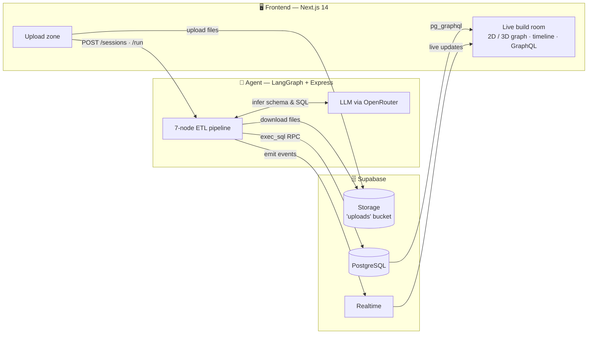
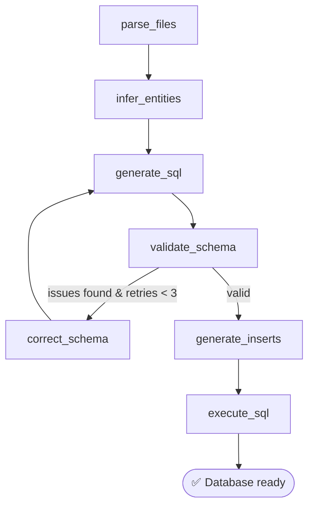

# Data Lake → SQL

**Turn messy file dumps into a normalized SQL database — automatically, with an AI agent.**

[](#)
[](https://nextjs.org/)
[](https://www.typescriptlang.org/)
[](https://supabase.com/)
[](https://langchain-ai.github.io/langgraphjs/)
[](./LICENSE)

Upload a pile of `CSV`, `JSON`, `XML`, and `TXT` files. An autonomous [LangGraph](https://langchain-ai.github.io/langgraphjs/) agent reads them, infers a relational schema (tables, columns, types, and foreign keys), writes the SQL, validates and self-corrects it, then executes it against Postgres — while the frontend streams every step as a live 2D/3D knowledge graph.

> 🏆 Built for a **Supabase Hackathon**, where it was a winning entry.

---

## How it works



The agent itself is a state machine that can recover from its own mistakes. If validation finds a problem (a dangling foreign key, a duplicate table), it loops back and rewrites the schema, up to three times, before giving up.



---

## Features

- **Multi-format ingestion** — CSV, JSON, XML, and unstructured TXT, with delimiter/format auto-detection.
- **AI schema inference** — detects tables, columns, and data types from raw samples.
- **Entity resolution** — finds relationships across files (e.g. links `orders.json` to `customers.csv` via a foreign key).
- **Self-correcting agent** — a `validate → correct → regenerate` loop catches schema errors before they hit the database.
- **Real-time visualization** — watch the schema build itself as a 2D ([React Flow](https://reactflow.dev/)) and 3D ([React Three Fiber](https://docs.pmnd.rs/react-three-fiber)) knowledge graph, alongside a live event timeline.
- **Drift detection** — flags incoming data that doesn't fit the inferred schema.
- **Query it live** — an in-app GraphQL explorer (via Supabase `pg_graphql`) lets you query the database the moment it's built.

## Tech stack

| Layer | Stack |
| --- | --- |
| **Frontend** | Next.js 14 (App Router), React 18, Tailwind CSS, shadcn/ui, React Flow, React Three Fiber |
| **Agent** | Node.js, TypeScript (ESM), LangGraph, Express, Zod |
| **LLM** | Any model via [OpenRouter](https://openrouter.ai/) (configurable with `OPENROUTER_MODEL`) |
| **Backend** | Supabase — PostgreSQL, Storage, Realtime, Auth, `pg_graphql` |

## Repository layout

```
.
├── frontend/   # Next.js app — uploads + real-time build visualization (port 3000)
├── agent/      # LangGraph ETL agent + Express REST API (port 3001)
├── backend/    # Supabase migrations, RPCs, and edge functions
└── sample-data/# Demo e-commerce dataset (10 mixed-format files)
```

The agent pipeline lives in `agent/src/graph/` (`state.ts`, `graph.ts`, `nodes.ts`); the database control plane and the `exec_sql` RPC are defined in `backend/supabase/migrations/`.

---

## Getting started

### Prerequisites

- Node.js 18+
- A Supabase project (cloud, or local via the Supabase CLI)
- An [OpenRouter API key](https://openrouter.ai/keys)

### 1. Set up Supabase

1. Create a Supabase project (or run `npx supabase start` for a local stack).
2. Apply the migrations in `backend/supabase/migrations/`. They create the control-plane tables (`build_sessions`, `build_events`), the security-definer `exec_sql` RPC, and the `uploads` storage bucket.

### 2. Configure environment variables

**Agent** — copy `agent/.env.example` to `agent/.env`:

```env
SUPABASE_URL=your_supabase_url
SUPABASE_SERVICE_ROLE_KEY=your_service_role_key   # admin access — keep secret
OPENROUTER_API_KEY=your_openrouter_key
PORT=3001
```

**Frontend** — copy `frontend/.env.local.example` to `frontend/.env.local`:

```env
NEXT_PUBLIC_SUPABASE_URL=your_supabase_url
NEXT_PUBLIC_SUPABASE_ANON_KEY=your_supabase_anon_key
NEXT_PUBLIC_BACKEND_BASE_URL=http://localhost:3001
NEXT_PUBLIC_AGENT_URL=http://localhost:3001
```

### 3. Run it

```bash
# Terminal 1 — agent (port 3001)
cd agent && npm install && npm run dev

# Terminal 2 — frontend (port 3000)
cd frontend && npm install && npm run dev
```

Open <http://localhost:3000>, click **Load Sample E-Commerce Data**, hit **Analyze & Build Database**, and watch the agent assemble your database in real time.

## Security model

- The frontend uses the Supabase **anon key** (safe for the browser); RLS blocks direct access to control-plane tables.
- The agent uses the **service-role key** and runs all generated DDL/DML through the `exec_sql` security-definer RPC, which is callable only by the service role.
- Share tokens allow read-only viewing of a build session without auth.

## License

[MIT](./LICENSE) © Joshua Broad & Izgin Ozdas
